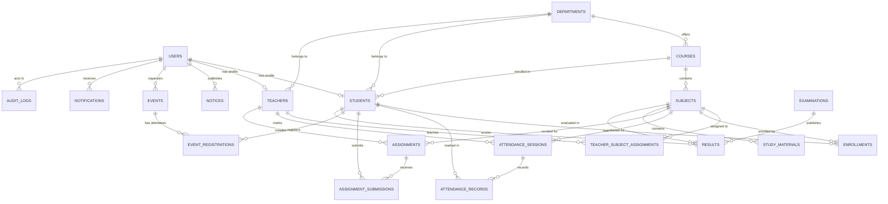

# CampusConnect – Database Schema Documentation

## 1. Overview
CampusConnect utilizes a normalized relational database schema designed for high integrity, clear foreign key relationships, auditability, and role-based data partitioning. The schema is implemented using SQLAlchemy ORM and supports MySQL 8+ with fallback for SQLite local development.

---

## 2. Entity Relationship Diagram (ERD)

---

## 3. Entity Details & Schema Specifications

### `users`
Core authentication and user identity table.
- `id` (INTEGER, Primary Key, Auto Increment)
- `full_name` (VARCHAR(120), NOT NULL)
- `email` (VARCHAR(120), NOT NULL, UNIQUE, Indexed)
- `password_hash` (VARCHAR(255), NOT NULL)
- `role` (VARCHAR(20), NOT NULL, Indexed) – Values: `'admin'`, `'teacher'`, `'student'`
- `phone` (VARCHAR(20), NULL)
- `avatar_url` (VARCHAR(255), NULL)
- `is_active` (BOOLEAN, Default: TRUE, NOT NULL)
- `created_at` (DATETIME, Default: UTC NOW)
- `updated_at` (DATETIME, Default: UTC NOW, OnUpdate: UTC NOW)

### `departments`
Academic faculties/branches.
- `id` (INTEGER, Primary Key)
- `name` (VARCHAR(100), NOT NULL, UNIQUE)
- `code` (VARCHAR(20), NOT NULL, UNIQUE, Indexed) – e.g. `'CSE'`, `'IT'`, `'ECE'`
- `description` (TEXT, NULL)
- `created_at` (DATETIME)

### `courses`
Degree programs offered by departments.
- `id` (INTEGER, Primary Key)
- `name` (VARCHAR(100), NOT NULL) – e.g. `'B.Tech Computer Science & Engineering'`
- `code` (VARCHAR(20), NOT NULL, UNIQUE, Indexed)
- `department_id` (INTEGER, FK -> `departments.id`, CASCADE)
- `semester_count` (INTEGER, Default: 8)
- `academic_year` (VARCHAR(20))
- `created_at` (DATETIME)

### `subjects`
Course curriculum subjects.
- `id` (INTEGER, Primary Key)
- `name` (VARCHAR(100), NOT NULL)
- `code` (VARCHAR(20), NOT NULL, UNIQUE, Indexed) – e.g. `'CS302'`
- `course_id` (INTEGER, FK -> `courses.id`, CASCADE)
- `semester` (INTEGER, NOT NULL)
- `credits` (INTEGER, Default: 4)
- `created_at` (DATETIME)

### `students`
Student academic profiles linked to user accounts.
- `id` (INTEGER, Primary Key)
- `user_id` (INTEGER, FK -> `users.id`, CASCADE, UNIQUE)
- `enrollment_number` (VARCHAR(50), NOT NULL, UNIQUE, Indexed)
- `department_id` (INTEGER, FK -> `departments.id`)
- `course_id` (INTEGER, FK -> `courses.id`)
- `current_semester` (INTEGER, Default: 1)
- `admission_year` (INTEGER, NOT NULL)
- `date_of_birth` (DATE, NULL)
- `created_at` (DATETIME)
- `updated_at` (DATETIME)

### `teachers`
Faculty profiles linked to user accounts.
- `id` (INTEGER, Primary Key)
- `user_id` (INTEGER, FK -> `users.id`, CASCADE, UNIQUE)
- `employee_id` (VARCHAR(50), NOT NULL, UNIQUE, Indexed)
- `department_id` (INTEGER, FK -> `departments.id`)
- `designation` (VARCHAR(100), Default: `'Assistant Professor'`)
- `qualification` (VARCHAR(150), NULL)
- `created_at` (DATETIME)
- `updated_at` (DATETIME)

### `teacher_subject_assignments`
Mapping faculty to subjects.
- `id` (INTEGER, Primary Key)
- `teacher_id` (INTEGER, FK -> `teachers.id`, CASCADE)
- `subject_id` (INTEGER, FK -> `subjects.id`, CASCADE)
- `academic_year` (VARCHAR(20), NOT NULL)
- `semester` (INTEGER, NOT NULL)
- `created_at` (DATETIME)
- **Constraints**: `UNIQUE(teacher_id, subject_id, academic_year)`

### `enrollments`
Student subject enrollment table.
- `id` (INTEGER, Primary Key)
- `student_id` (INTEGER, FK -> `students.id`, CASCADE)
- `subject_id` (INTEGER, FK -> `subjects.id`, CASCADE)
- `academic_year` (VARCHAR(20), NOT NULL)
- `semester` (INTEGER, NOT NULL)
- `status` (VARCHAR(20), Default: `'active'`)
- **Constraints**: `UNIQUE(student_id, subject_id, academic_year)`

### `attendance_sessions`
Lecture session events.
- `id` (INTEGER, Primary Key)
- `subject_id` (INTEGER, FK -> `subjects.id`, CASCADE)
- `teacher_id` (INTEGER, FK -> `teachers.id`, SET NULL)
- `session_date` (DATE, NOT NULL, Indexed)
- `start_time` (VARCHAR(20), NULL)
- `topic` (VARCHAR(200), NULL)
- `created_at` (DATETIME)

### `attendance_records`
Individual student attendance status per lecture session.
- `id` (INTEGER, Primary Key)
- `session_id` (INTEGER, FK -> `attendance_sessions.id`, CASCADE)
- `student_id` (INTEGER, FK -> `students.id`, CASCADE)
- `status` (VARCHAR(20), NOT NULL) – `'present'`, `'absent'`, `'late'`, `'excused'`
- `remarks` (VARCHAR(255), NULL)
- `marked_at` (DATETIME)
- `updated_at` (DATETIME)
- **Constraints**: `UNIQUE(session_id, student_id)`

### `assignments`
Course assignments published by faculty.
- `id` (INTEGER, Primary Key)
- `title` (VARCHAR(200), NOT NULL)
- `description` (TEXT, NOT NULL)
- `subject_id` (INTEGER, FK -> `subjects.id`, CASCADE)
- `teacher_id` (INTEGER, FK -> `teachers.id`, CASCADE)
- `due_date` (DATETIME, NOT NULL, Indexed)
- `total_marks` (FLOAT, Default: 100.0)
- `attachment_path` (VARCHAR(255), NULL)
- `attachment_name` (VARCHAR(255), NULL)
- `status` (VARCHAR(20), Default: `'published'`) – `'published'`, `'draft'`, `'closed'`
- `created_at` (DATETIME)
- `updated_at` (DATETIME)

### `assignment_submissions`
Student solution submissions and evaluation marks.
- `id` (INTEGER, Primary Key)
- `assignment_id` (INTEGER, FK -> `assignments.id`, CASCADE)
- `student_id` (INTEGER, FK -> `students.id`, CASCADE)
- `submission_text` (TEXT, NULL)
- `file_path` (VARCHAR(255), NULL)
- `file_name` (VARCHAR(255), NULL)
- `submitted_at` (DATETIME)
- `status` (VARCHAR(20), Default: `'submitted'`) – `'submitted'`, `'late'`, `'graded'`
- `marks` (FLOAT, NULL)
- `feedback` (TEXT, NULL)
- `graded_at` (DATETIME, NULL)
- `graded_by_id` (INTEGER, FK -> `teachers.id`, SET NULL)
- **Constraints**: `UNIQUE(assignment_id, student_id)`

### `study_materials`
Lecture notes, question banks, and reference materials.
- `id` (INTEGER, Primary Key)
- `title` (VARCHAR(200), NOT NULL)
- `description` (TEXT, NULL)
- `subject_id` (INTEGER, FK -> `subjects.id`, CASCADE)
- `uploaded_by` (INTEGER, FK -> `users.id`, SET NULL)
- `file_path` (VARCHAR(255), NOT NULL)
- `file_name` (VARCHAR(255), NOT NULL)
- `file_type` (VARCHAR(50), NOT NULL) – `'pdf'`, `'docx'`, `'pptx'`, `'zip'`
- `file_size_bytes` (BIGINT, Default: 0)
- `created_at` (DATETIME)

### `notices`
Institutional circulars and notices.
- `id` (INTEGER, Primary Key)
- `title` (VARCHAR(255), NOT NULL)
- `content` (TEXT, NOT NULL)
- `created_by` (INTEGER, FK -> `users.id`, SET NULL)
- `audience` (VARCHAR(30), Default: `'all'`) – `'all'`, `'students'`, `'teachers'`, `'department'`
- `target_department_id` (INTEGER, FK -> `departments.id`, SET NULL)
- `priority` (VARCHAR(20), Default: `'medium'`) – `'low'`, `'medium'`, `'high'`, `'urgent'`
- `published_at` (DATETIME)
- `expires_at` (DATETIME, NULL)
- `is_active` (BOOLEAN, Default: TRUE)
- `created_at` (DATETIME)
- `updated_at` (DATETIME)

### `events`
Campus symposiums, hackathons, and activities.
- `id` (INTEGER, Primary Key)
- `title` (VARCHAR(200), NOT NULL)
- `description` (TEXT, NOT NULL)
- `venue` (VARCHAR(200), NOT NULL)
- `start_datetime` (DATETIME, NOT NULL, Indexed)
- `end_datetime` (DATETIME, NOT NULL)
- `organizer_id` (INTEGER, FK -> `users.id`, SET NULL)
- `capacity` (INTEGER, Default: 100)
- `status` (VARCHAR(20), Default: `'upcoming'`) – `'upcoming'`, `'ongoing'`, `'completed'`, `'cancelled'`
- `image_url` (VARCHAR(255), NULL)
- `created_at` (DATETIME)

### `event_registrations`
Student attendee registrations.
- `id` (INTEGER, Primary Key)
- `event_id` (INTEGER, FK -> `events.id`, CASCADE)
- `student_id` (INTEGER, FK -> `students.id`, CASCADE)
- `registered_at` (DATETIME)
- `status` (VARCHAR(20), Default: `'registered'`) – `'registered'`, `'attended'`, `'cancelled'`
- **Constraints**: `UNIQUE(event_id, student_id)`

### `examinations`
Semester and mid-term assessments.
- `id` (INTEGER, Primary Key)
- `name` (VARCHAR(100), NOT NULL)
- `academic_year` (VARCHAR(20), NOT NULL)
- `semester` (INTEGER, NOT NULL)
- `exam_type` (VARCHAR(50), Default: `'final'`) – `'midterm'`, `'final'`, `'quiz'`, `'practical'`
- `start_date` (DATE, NULL)
- `end_date` (DATE, NULL)
- `is_published` (BOOLEAN, Default: TRUE)
- `created_at` (DATETIME)

### `results`
Student examination marks and letter grades.
- `id` (INTEGER, Primary Key)
- `examination_id` (INTEGER, FK -> `examinations.id`, CASCADE)
- `student_id` (INTEGER, FK -> `students.id`, CASCADE)
- `subject_id` (INTEGER, FK -> `subjects.id`, CASCADE)
- `marks_obtained` (FLOAT, NOT NULL)
- `maximum_marks` (FLOAT, Default: 100.0)
- `grade` (VARCHAR(5), NULL) – `'A+'`, `'A'`, `'B'`, `'C'`, `'D'`, `'E'`, `'F'`
- `remarks` (VARCHAR(255), NULL)
- `created_at` (DATETIME)
- `updated_at` (DATETIME)
- **Constraints**: `UNIQUE(examination_id, student_id, subject_id)`

### `notifications`
User alert and notification messages.
- `id` (INTEGER, Primary Key)
- `recipient_user_id` (INTEGER, FK -> `users.id`, CASCADE, Indexed)
- `title` (VARCHAR(150), NOT NULL)
- `message` (TEXT, NOT NULL)
- `notification_type` (VARCHAR(50), Default: `'system'`)
- `link` (VARCHAR(255), NULL)
- `is_read` (BOOLEAN, Default: FALSE)
- `created_at` (DATETIME)

### `audit_logs`
Security and administrative audit trail.
- `id` (INTEGER, Primary Key)
- `actor_user_id` (INTEGER, FK -> `users.id`, SET NULL, Indexed)
- `action` (VARCHAR(100), NOT NULL) – e.g. `'USER_LOGIN'`, `'ATTENDANCE_MARKED'`, `'SUBMISSION_GRADED'`
- `entity_type` (VARCHAR(50), NOT NULL)
- `entity_id` (INTEGER, NULL)
- `ip_address` (VARCHAR(50), NULL)
- `user_agent` (VARCHAR(255), NULL)
- `metadata_json` (TEXT, NULL) – Sanitized JSON without credentials
- `created_at` (DATETIME, Indexed)
